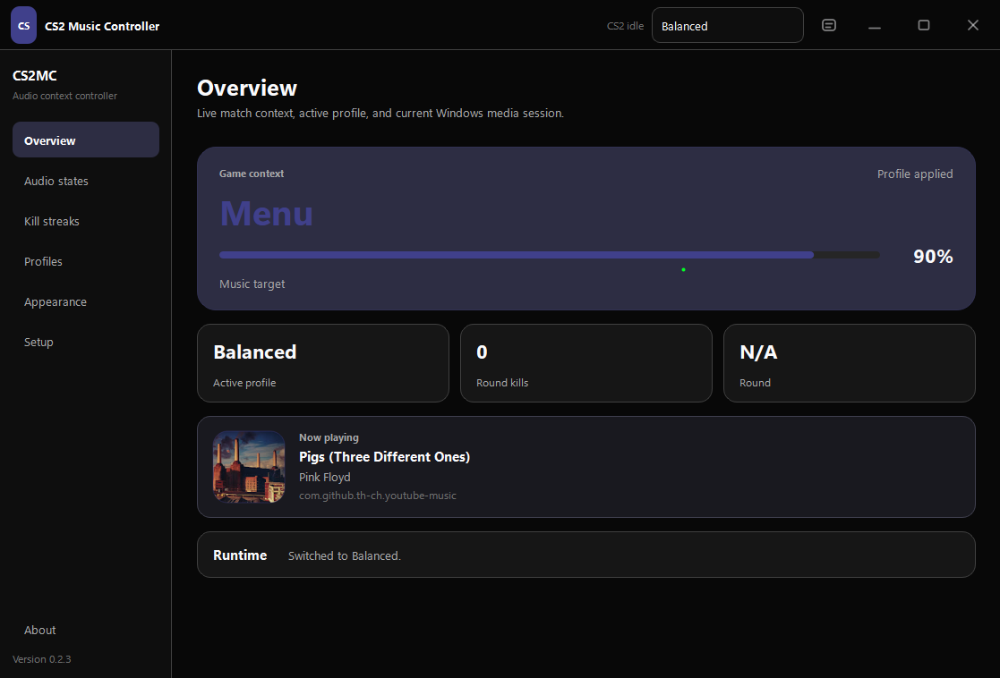

<div align="center">
  
  <h1>CS2 Music Controller</h1>
  <p><strong>Native Windows music control and custom event sounds for Counter-Strike 2.</strong></p>
  <p>
    <a href="#features">Features</a> ·
    <a href="#installation">Installation</a> ·
    <a href="#how-it-works">How it works</a> ·
    <a href="#development">Development</a> ·
    <a href="https://github.com/notskrillence/CS2-Music-Controller">GitHub</a>
  </p>
</div>
<div align="center">
  
</div>
## Status

This repository contains the first native desktop release foundation. It focuses on one job: making CS2 game-event audio easy to install, configure, and use.

- Windows per-process audio control
- Automatic CS2 cfg discovery
- Game State Integration setup and repair
- One-click profiles, presets, and Ctrl+1 through Ctrl+5 switching
- Custom WAV event sounds and WAV/MP3 kill-streak packs
- Custom kill-streak sequences
- Material-inspired themes with optional album-derived accents
- Localhost-only authenticated listener

## Features

### Automatic CS2 setup

On first launch, the application searches Steam registry locations, standard Steam folders, and every path in `libraryfolders.vdf`. When it finds CS2, it installs its Game State Integration configuration automatically. When detection fails, the user is asked to select:

```text
...\Counter-Strike Global Offensive\game\csgo\cfg
```

The generated integration sends only the data used by the application to `127.0.0.1` and includes a unique local token.

### Context-aware music levels

Set a separate music volume for:

| State | Behavior |
|---|---|
| Menu | Full-volume browsing and inventory time |
| In Game | Lower music during live play |
| Buy Time | Raise music during freeze/buy phase |
| Spectating | Restore music after elimination or while observing |
| Bomb Planted | Dedicated pressure-state volume |
| Round Over | Post-round transition volume |
| Warmup | Separate pre-match level |

Volume changes run on a coalescing background worker, so rapid GSI updates do not block the listener or interface.

### Custom event sounds

Each supported state can play an optional WAV file when the state begins. State sounds have their own enable switch and volume control.

### Kill-streak sequences

Kill-streak sound profiles are independent from music profiles. Assign WAV or MP3 audio to kills one through five, then switch packs directly from the Kill Streaks page without changing any music levels. The sequence uses CS2's round-kill value and resets when the map round changes. The three built-in profiles are **VALORANT**, **Reaver**, and **Tones**. Their definitions resolve the expected files from `assets/sounds/default`, and missing files are identified directly in the interface.

### Profiles and presets

Audio profiles store:

- State volumes
- Fade duration
- Target media process
- State transition sounds and their volume/enable state

Kill-streak profiles are stored and switched independently, including their five sound files, volume, and enable state.

Bundled presets provide three starting points: **Balanced**, **Focus**, and **Cinematic**. Profiles switch immediately from the integrated title bar or one-click cards. They can also be created, renamed, duplicated, imported, exported, and deleted. The first five profiles are available through `Ctrl+1` to `Ctrl+5`.

### Appearance and album-aware color

The interface uses a near-AMOLED surface hierarchy and one coordinated accent role instead of unrelated per-state colors. Appearance modes include:

- **Album dynamic** — samples Windows media artwork once per track, caches the result, and uses it for selection and emphasis
- **CS2MC dark** — stable branded dark palette
- **Custom seed** — user-selected accent with contrast, surface darkness, radius, aura, and motion controls

Bomb, warning, success, and error colors remain semantic and do not change with album artwork. Essential fonts and interface assets are local; the application does not depend on an internet font request. Window controls and compact action icons are painter-drawn, avoiding inconsistent symbol-font fallbacks.

### Music target selection

Use the active Windows media player automatically, or pin a specific process such as Spotify, YouTube Music, Firefox, or foobar2000. Active Windows audio sessions are highlighted in the selector.

## Installation

### Run from source

Requirements:

- Windows 10 or Windows 11
- Python 3.11+
- Counter-Strike 2 installed through Steam

Run the one-time development setup:

```text
setup_dev.bat
```

Then double-click:

```text
run_dev.bat
```

`run_dev.bat` launches through `pythonw.exe` as a detached GUI process, so no command prompt remains open.

### Build the Windows installer

1. Install Python 3.11 and Inno Setup 6.
2. Open PowerShell in the repository.
3. Run:

```powershell
powershell -ExecutionPolicy Bypass -File .\build_release.ps1
```

The build uses PyInstaller's `onedir` mode for faster startup and simpler diagnosis. The final installer is written to:

```text
installer\output\CS2MusicController-Setup-0.2.3.exe
```

When Inno Setup is unavailable, the portable build remains in `dist\CS2MusicController`.

## How it works

```text
CS2 GSI POST
    │
    ▼
Authenticated 127.0.0.1 listener
    │
    ▼
State resolver ───────────────► Native dashboard
    │                              │
    ├── state transition           └── WAV/MP3 sound playback
    │
    └── coalesced volume command
             │
             ▼
      Windows audio session
```

The program does not inject into CS2, read process memory, inspect packets, draw a game overlay, or expose a network service. It consumes Valve's Game State Integration payloads and adjusts a Windows audio session.

More detail: [Architecture](docs/architecture.md)

## Data and configuration

Application data is stored in:

```text
%APPDATA%\CS2MusicController
```

Contents:

```text
settings.json                    Active audio/kill-streak profiles, CS2 path, token, port, and appearance
profiles\*.json                  Audio profiles
kill_streak_profiles\*.json      Independent kill-streak sound profiles
```

The CS2 integration file is:

```text
gamestate_integration_cs2_music_controller.cfg
```

Deleting that file disconnects CS2 from the application. The Setup page can reinstall or repair it.

## Development

Install development dependencies once:

```text
setup_dev.bat
```

Run tests when making changes:

```powershell
.\.venv\Scripts\python.exe -m pytest -q
```

For interface demonstrations without launching CS2, start the application and send a synthetic state:

```powershell
python tools\send_test_gsi.py bomb_planted --kills 3
```

Current tests cover:

- Required CS2 state classification
- Kill-streak increment and round reset behavior
- Rejection of non-CS2 payloads
- Steam library VDF parsing
- Local tokenized GSI generation
- Audio-profile creation, rename, persistence, switching, and deletion
- Independent kill-streak profile defaults, switching, persistence, and legacy migration
- Appearance migration, normalization, and persistence
- Dynamic accent generation with neutral AMOLED surfaces

## Project structure

```text
app.py                              Application entry point
src/cs2mc/gui.py                    Window shell, navigation registry, and coordination
src/cs2mc/ui_components.py          Painter-drawn controls and reusable widgets
src/cs2mc/ui_pages/                 One module per application page
src/cs2mc/app_metadata.py           Repository, author, and product metadata
src/cs2mc/external_links.py         Centralized trusted-link handling
src/cs2mc/theme.py                  Material-inspired roles, Qt palette, and stylesheet
src/cs2mc/media_session.py          Track metadata and album artwork monitor
src/cs2mc/runtime.py                Runtime coordination
src/cs2mc/state_engine.py           GSI state and kill resolver
src/cs2mc/gsi_server.py             Authenticated local listener
src/cs2mc/audio_controller.py       Background Windows volume control
src/cs2mc/cs2_locator.py            Steam/CS2 discovery and GSI installer
src/cs2mc/config.py                 Atomic settings and profile storage
src/cs2mc/sound_player.py           Overlapping WAV/MP3 playback
installer/                          Inno Setup definition
```


## Credits

Created by **skrilll**.

- GitHub: **notskrillence**
- Discord: **skrilll**

## Contributing

Bug reports and focused pull requests are welcome. Read [CONTRIBUTING.md](CONTRIBUTING.md) before opening a change.

## License

MIT. See [LICENSE](LICENSE).
